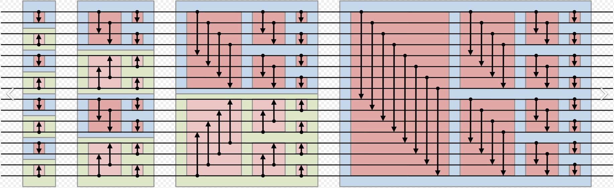

# Введение

Это реализация битонической сортировки на видеокарте с использованием OpenCL

# Код host'а

Я использовал представление битонической сортировки в виде 5 вложенных циклов. 2 внешних исполняются последовательно, а 3 внутренних - могут параллельно.
Сортировка происходит следующим образом: в самом начале массив делится на подмассивы из 2 элементов, каждый из которых образует битоническую последовательность (тут вводится первый параметр - biton_size, по нему итерируется внешний цикл - на каждой итерации biton_size увеличивается вдвое). 

Далее внутренний цикл совершает так называемую операцию Merge - в этом цикле битоническая последовательность превращается в монотонную, причем в убывающую - или возрастащую - зависит от того, какая это половина битонической последовательности. В операции Merge происходят перестановки сначала по всей битонной последовательности, потом она делится пополам - и делается то же самое (тут вводится второй параметр - bucket_size - размер подмассивов, на которые бьётся битоническая последовательность - делится пополам на каждой итерации. В начале внутреннего цикла bucket_size = biton_size).

2 внешних цикла разбиваются так:
1) итерирование по biton_size
2) итерирование по bucket_size
Соответственно, каждый цикл домножает сложность на log2(n) - и между каждой итерацией у нас event.wait()

3 внутренних цикла могут выполняться параллельно (если видеокарта позволяет).
3 измерения получаются из следующих соображений:
1) итерирование по каждой битонической последовательности
2) внутри битонической последовательности - итерировние по bucket'ам
3) внутри каждого bucket'а - итерирование по нему как по массиву
Внутренние циклы не синхронизируются, так как принимаемые ядрами данные независимы.

Лучше всего, если размер массива кратен 2, иначе массив дополяется до степени 2 максимальными значениями, которые сортируются, а потом отбрасываются (строго говоря, на этом этапе происходит лишнее копирование, которые можно было бы убрать). Performance может падать до 50%.

# Код kernel'а

Здесь есть 3 функции:
1) big_bucket - при очень больших размерах bucket'ов
2) big_biton - при большом размере битонических последовательностей, но небольших bucket'ах
3) small_biton - соответсвенно, если малы и те, и другие

"Большие" и "маленькие" - в сравнении с константой WORK_GROUP_SIZE, которая (неожиданно) задаёт размер рабочей группы. Стоит отметить, что рабочие группы - трёхмерные, это константа задаёт произведение размеров по измерениям.

В kernel'е по максимуму используется локальная память. В каждой функции в локальную память сначала загружаются данные - потом стоит барьер - процессы ожидают, пока все догрузят. Затем происходит сортировка - барьер - и выгрузка обратно в глобальную память. Причём загрузка данных из глобального буффера - cache friendly - в локальную память данные загружаются кэш-линиями - и если один work item запросил запросил из некоторого места в глобальной памяти, а соседние (по рабочей группе) с ним worl item'ы загружают с соседних мест - то данные загружаются эффективно. Таким образом существенно уменьшается количество загрузок на каждой итерации.

Причём локальной памяти используется немного, поэтому остаётся место для создания нескольких контекстов в рамках одной work group {предположительно}

# Performance

На -O2 мне удалось добиться скорости, сравнимой с std::sort. Мой компьютер выдал следующие цифры:

| ARR_SIZE			 | на CPU, мс |	битоническая сортировка, мс	| на GPU, мс |
| ------------------ | ---------- | ----------------------------| ---------- |
| 4 194 304 (2^22)	 | 120		  |	80							| 60  		 |
| 268 435 456 (2^28) | 5100	 	  |	6800						| 5300       |
| 4 000 000			 | 105		  |	100							| 65 		 |
| 5 000 000			 | 140        |	180							| 125  		 |

